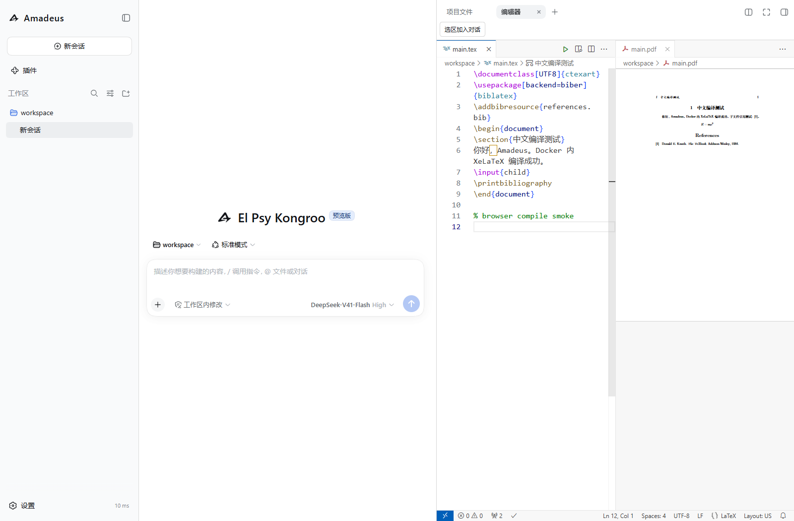
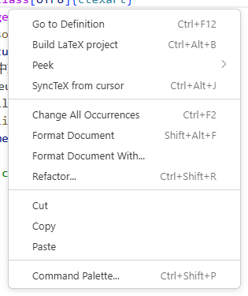

<p align="center">
  
</p>

<h1 align="center">Amadeus</h1>

<p align="center">扩展 DSH 的文档查看、文本编辑与选区对话能力</p>

<p align="center">
  
  
  
</p>



Amadeus 是一组面向单用户服务器工作台的 DSH 插件。它把项目文件、文档阅读、代码编辑和选区对话放在同一个界面中，使 DSH 可以直接处理 PDF、Office、Markdown、LaTeX 和常见文本文件。PDF、Office 与终端预览由 DSH 原生侧栏提供，Amadeus 负责编辑器、编译和选区对话。

`v1.1.0-alpha.2` 基于 `@deepseek-ai/dsh@0.1.6-alpha.2`，将编辑器迁至内嵌 code-server，并通过 Docker 内的 TeX Live 编译 LaTeX。保留原生 PDF/Office 预览、选区问答及中文输入增强。

## 主要能力

| 领域 | 能力 |
| --- | --- |
| 文档阅读 | DSH 原生侧栏预览 PDF 与 Office 文档（含 Excel），Amadeus 注入清晰的蓝色选中高亮，注释引用可跳转到原文页 |
| 文本编辑 | 内嵌 code-server：文件标签、补全、查找替换、撤销/重做与保存；同一侧栏工作台内切换文件 |
| 文件同步 | 文件读写、外部修改检测及保存冲突处理由 VS Code 工作台负责；不再维护第二份浏览器草稿 |
| Markdown | code-server 内置 Markdown 预览、侧边预览与滚动联动 |
| LaTeX | Docker 内 TeX Live + latexmk/XeLaTeX + LaTeX Workshop；支持项目子文件、图片、参考文献与 PDF 预览 |
| 选区对话 | 对话或文件选区加入注释（含原生 PDF 预览内的选区页码），回答中的蓝色引用支持悬浮查看和原文定位，原选区以浅蓝荧光高亮 |
| 文件管理 | 文件和文件夹上传、ZIP 下载、重名确认、删除确认、目录轮询与服务器变更自动刷新 |
| 远程访问 | 浏览器原生 Basic 认证、HTTPS 反向代理、登录后完整 DSH 设置能力 |
| 浏览器自动化 | Playwright MCP 浏览器操作，模型原生支持网页导航、点击、填表、截图、无障碍 DOM 快照与 JS 执行，启动自检自动拉取资源 |

## 工作方式

```text
浏览器
  ├─ DSH 对话与模型能力
  ├─ DSH 原生侧栏：PDF/Office 预览（文字层 + 蓝色选中）、终端、浏览器
  └─ Amadeus：文件树 / 内嵌 code-server / 选区问答
          │
Amadeus Node.js 服务
  ├─ 认证与静态前端
  ├─ 文件路由、code-server HTTP/WebSocket 认证代理
  └─ Docker：code-server、Amadeus Bridge、LaTeX Workshop、TeX Live
```

Office 文件由 DSH 原生 `dsh-office-to-pdf`（LibreOffice 引擎）转换为 PDF 并在侧栏渲染可选择文字层；Amadeus 把选中色覆盖为固定的半透明蓝。Markdown 在 code-server 的浏览器预览中渲染；LaTeX 由 Docker 内的 TeX Live 编译。Pad 无需加载 SwiftLaTeX WASM、宏包和编译字体。

## Docker 部署（电脑运行，Pad 远程访问）

安装 Docker Desktop（Linux 容器）或 Docker Engine / Compose。

```bash
cp amadeus.docker.example.yml amadeus.local.yml
mkdir -p workspace
# 编辑 amadeus.local.yml，设置真实的用户名和密码。
docker compose up -d --build
```

若当前网络无法访问 Docker Hub，可先执行 `docker compose build --build-arg NODE_IMAGE=public.ecr.aws/docker/library/node:24-bookworm-slim`，通过 Docker Official Images 的 AWS 镜像源获取基础镜像，再执行 `docker compose up -d`。

浏览器访问 `http://127.0.0.1:3080`。内网穿透指向电脑的 `127.0.0.1:3080`，对外提供有效证书的 **HTTPS**；代理须支持 WebSocket。Android 浏览器中的 Markdown/PDF webview 依赖安全上下文，不能用远程 HTTP 地址代替 HTTPS。

镜像包含 code-server、LaTeX Workshop、TeX Live/XeLaTeX、latexmk、Biber 和中文字体。首次构建需要下载这些组件，体积明显大于旧版 Node 服务。`workspace/` 挂载为 `/workspace`；命名卷保存 DSH 会话、VS Code 设置、扩展及编辑器恢复数据。不要删除数据卷来更新版本。

默认只向电脑回环地址发布 3080；8080 上的无密码 code-server 仅在容器回环地址监听，经 Amadeus 已认证的 HTTP/WebSocket 路由访问。

启动时会自动注册配置的 `/workspace`，Pad 可以直接选择该工作区；无需调用宿主机的原生目录选择窗口。要换挂载目录，修改 Compose 的工作区挂载和配置中的 `workspace`。

打开文本、代码、`.md` 或 `.tex` 文件会进入内嵌编辑器；同一侧栏中的后续文件在 VS Code 内打开标签。PDF、Office 等文档仍使用 DSH 原生预览。保存、撤销、MD 预览和 TeX 编译均使用 code-server / LaTeX Workshop 原生界面与快捷键；Amadeus 仅保留「选区加入对话」桥接动作和连接错误提示。

常用快捷键：`Ctrl+S` 保存、`Ctrl+Z` 撤销、`Ctrl+Shift+Z` 重做、`Ctrl+Shift+V` Markdown 预览、`Ctrl+K` 后按 `V` Markdown 侧边预览；LaTeX Workshop 默认 `Ctrl+Alt+B` 编译、`Ctrl+Alt+V` 查看 PDF。全部命令可在 `Ctrl+Shift+P` 命令面板中查找。

已开启 LaTeX Workshop 原生右键菜单（编译、SyncTeX 定位）；TeX 编译/PDF 查看和 Markdown 侧边预览也有编辑器右上角入口。Markdown「打开预览」还位于 code-server 自带文件树的右键菜单中。



### LaTeX

默认配方为 `latexmk -xelatex`，由 LaTeX Workshop 管理主文件、重复编译、日志和 PDF 查看。多文件论文可在源码中使用 `% !TEX root = ../main.tex` 指定主文件。中文模板可使用 `ctexart`；特殊宏包或字体仍需加入镜像。`latex-workshop.latex.autoBuild.run` 默认是 `never`，避免每次键入都触发编译与 PDF 重传。

镜像对固定版本 LaTeX Workshop 的 PDF 字体资源相对路径应用兼容补丁，使中文 CMap 和标准字体能通过内嵌子路径加载。更换扩展版本时需同时验证并更新该补丁。

保存的 TeX 源码和编译产物均在项目目录；不再提供 `/amadeus/texlive` 或浏览器编译接口。原来的打印导出和手写 Markdown 渲染器也已移除，所需额外 Markdown 能力可通过兼容 VS Code 扩展添加。

### 从旧版升级

升级前请保存旧编辑器里的草稿，并备份 DSH 数据目录和项目文件。迁入 Docker 时，历史会话和工作区记录中的路径必须与容器内挂载路径对应，不能直接沿用 Windows 路径。已有密钥文件应迁入具备 Linux 权限语义的数据卷并保持仅所有者可读；不要通过放宽权限检查来迁移。

### 非 Docker 开发

仍可运行 `npm ci && npm run build && npm start`，但编辑器需要另外启动 code-server 并安装 `packages/editor/extension` 中的桥接扩展及 LaTeX Workshop。将 code-server 配置为回环地址 `--auth none`，其进程的 `AMADEUS_EDITOR_BRIDGE_DIR` 必须与 Amadeus `editor.bridgeDir` 指向同一路径；Amadeus 的认证代理同时转发工作台及扩展动态端口的 WebSocket。完整配置见 [示例](amadeus.example.yml)。Docker 已完成这些配置。

## Playwright MCP 浏览器自动化

Amadeus 默认启用 Playwright MCP 服务。模型可直接调用 `mcp__playwright__browser_*` 工具与 Web 页面交互（访问网页、点击、填表、截图、提取无障碍快照等）。

启动时若未检测到 Chromium 内核，Amadeus 会自动拉取所需资源。Linux 云服务器可一键补齐所需系统动态链接库（`.so`）：

```bash
npm run setup:browsers
```

如需关闭或定制内核，可在 `amadeus.local.yml` 中设置：

```yaml
playwrightMcp:
  enabled: true       # 设为 false 可完全禁用
  browser: chromium   # 可选 chromium, chrome, msedge, firefox, webkit
  headless: true      # 服务器环境无头运行
  noSandbox: false    # Linux 容器或 root 运行时自动开启
```

## systemd 与 HTTPS

仓库提供 [systemd 模板](deploy/amadeus.service) 和 [nginx 模板](deploy/nginx.conf.example)。模板默认使用 `/srv/amadeus` 与 `amadeus` 服务用户：

```bash
sudo cp deploy/amadeus.service /etc/systemd/system/amadeus.service
sudo systemctl daemon-reload
sudo systemctl enable --now amadeus.service
sudo journalctl -u amadeus.service -f
```

公网部署应让 Amadeus 监听回环地址，由 nginx 提供 HTTPS。nginx 模板已包含 WebSocket、长连接和大文件上传设置。不要同时暴露另一套未认证的 DSH 服务。

可用 `AMADEUS_CONFIG=/absolute/path/config.yml` 指定外部配置文件。`home` 保存 DSH 会话、模型配置和编辑器工作区；升级前应先备份，不能把整个数据目录当作普通缓存删除。

## 配置

| 配置项 | 默认值 | 说明 |
| --- | --- | --- |
| `maxUploadBytes` | `1073741824` | 单文件上传上限，1 GiB |
| `maxPreviewBytes` | `268435456` | 原生 PDF 等文件预览的完整文件读取上限，256 MiB；修改 `amadeus.local.yml` 后重启生效 |
| `sessionHours` | `12` | 登录 WebSocket 凭据有效期 |
| `playwrightMcp.enabled` | `true` | 是否启用 Playwright MCP 浏览器自动化 |
| `playwrightMcp.browser` | `'chromium'` | 默认浏览器，可选 chrome, msedge 等 |

Docker 数据目录为 `/data/dsh-home`，编辑器设置与扩展位于 `/data/code-server`；生成的工作区保存在 `<home>/editor/workspaces`。非 Docker 默认数据目录仍为 `<项目>/.amadeus/dsh-home`。

## 权限与边界

- Amadeus 是单用户工作台。登录用户能够操作项目文件、终端和 DSH 设置，应视为可信服务器用户。
- 文件 API 和编辑器文件打开桥接限定在当前会话工作区；code-server 是完整 IDE，扩展和终端拥有容器用户权限，不能将桥接路径检查视为多用户安全沙箱。工作区根目录不能通过文件 API 删除。
- Basic 认证必须由 HTTPS 保护。HTTP 非安全来源中的 UUID 兼容实现不替代传输加密。
- PDF/Office 渲染与转换由 DSH 原生侧栏完成；扫描件无文字层，且不包含 OCR。
- Office 转换（LibreOffice 引擎）、字体替换、复杂公式和演示特效可能与原软件存在显示差异。

## 开发基线

```bash
npm test
npm run build
npm run pack:plugins
```

编辑器前端生命周期回归可运行 `npm run test:editor-browser`（默认使用已安装的 Edge，可用 `TEST_BROWSER_CHANNEL=chrome` 切换）。该测试验证文件切换、刷新恢复与多窗口隔离，使用模拟编辑器；真实 code-server、LaTeX 和 Pad 体验仍需在 Docker 环境验证。

打包结果位于 `.release/`：

- `dsh-amadeus-login-1.1.0-alpha.2.tgz`
- `dsh-amadeus-files-1.1.0-alpha.2.tgz`
- `dsh-amadeus-reader-1.1.0-alpha.2.tgz`
- `dsh-amadeus-editor-1.1.0-alpha.2.tgz`

代码结构：

```text
packages/login      认证和静态服务入口
packages/files      文件浏览与传输
packages/reader     原生文档增强与选区注释
packages/editor     code-server 代理、侧栏及 VS Code 桥接扩展
scripts             构建、打包和启动
tests               Node 集成与状态测试
ui                  Amadeus 共享样式
```

注释提示结构见 [docs/codex-selection-format.md](docs/codex-selection-format.md)。code-server 与 LaTeX Workshop 由 Docker 镜像安装；浏览器编译资产已删除。

## 1.0 升级说明

1.0 将所有项目自有命名空间统一为 `amadeus`。HTTP 路由、插件 ID、配置文件、环境变量、缓存键、数据目录、systemd 单元和 DOM 扩展点均发生变化。升级旧部署时应备份数据，并显式迁移到：

- 配置：`amadeus.local.yml`
- 环境变量：`AMADEUS_CONFIG`
- 服务：`amadeus.service`
- 应用路由：`/amadeus/*`
- 数据目录：`.amadeus/dsh-home`
- DSH Profile：`amadeus`

完整变化见 [CHANGELOG.md](CHANGELOG.md)。
