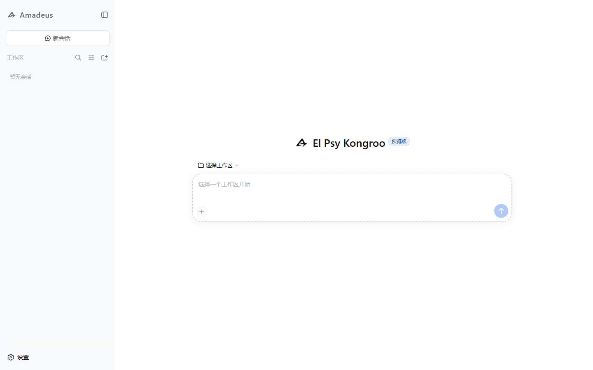

<p align="center">
  
</p>

<h1 align="center">Amadeus</h1>

<p align="center">扩展 DSH 的文档查看、文本编辑与选区对话能力</p>

<p align="center">
  
  
  
</p>



Amadeus 是一组面向单用户服务器工作台的 DSH 插件。它把项目文件、终端、文档阅读、代码编辑和选区对话放在同一个界面中，使 DSH 可以直接处理 PDF、Office、Markdown、LaTeX 和常见文本文件。

`v1.0.0` 是后续开发基座。该版本统一了 Amadeus 命名空间、部署结构、插件版本和文档，同时固定兼容 `@deepseek-ai/dsh@0.1.6-alpha.1`。

## 主要能力

| 领域 | 能力 |
| --- | --- |
| 文档阅读 | PDF、DOC/DOCX、PPT/PPTX 分页阅读，PDF.js 文字层、页码跳转、缩放、移动端双指缩放与大文件 Range 请求 |
| 文本编辑 | CodeMirror 6 语法高亮、自动换行、字号缩放、撤销/重做、`Ctrl/Cmd+S`、未保存状态与关闭确认 |
| 保存冲突 | 文件版本比较、服务器版本/本地版本选择、自动合并非重叠修改、`@codemirror/merge` 三方差异编辑 |
| Markdown | 安全解析、浏览器 KaTeX 数学公式、同标签预览、右侧并排预览与打印导出 |
| LaTeX | SwiftLaTeX XeTeX/dvipdfmx WASM 编译、`ctexart`、中文字体、常用 TikZ、PDF 文字层与下载 |
| 选区对话 | 对话或文件选区加入注释，回答中的蓝色引用支持悬浮查看和原文定位，原选区以浅蓝荧光高亮 |
| 文件管理 | 文件和文件夹上传、ZIP 下载、重名确认、删除确认、目录轮询与服务器变更自动刷新 |
| 终端 | 持久 WebSocket 连接、高延迟输入合并、会话恢复与 Amadeus 默认工作目录 |
| 远程访问 | 浏览器原生 Basic 认证、HTTPS 反向代理、登录后完整 DSH 设置能力 |
| 浏览器自动化 | Playwright MCP 浏览器操作，模型原生支持网页导航、点击、填表、截图、无障碍 DOM 快照与 JS 执行，启动自检自动拉取资源 |

## 工作方式

```text
浏览器
  ├─ DSH 对话与模型能力
  ├─ Amadeus 文件树 / CodeMirror / PDF.js / KaTeX / SwiftLaTeX
  └─ HTTPS + WebSocket
          │
Amadeus Node.js 服务
  ├─ 认证与静态前端
  ├─ 文件、保存、终端和 TeX Live 路由
  └─ ONLYOFFICE Document Builder → PDF 缓存
```

Office 文件通过 ONLYOFFICE Document Builder 转为 PDF 阅读版本，再由 PDF.js 渲染页面与可选择文字层。原文件不会被修改。Markdown 在浏览器中解析；LaTeX 在浏览器 WASM 中编译，服务器只通过 `kpsewhich` 提供所需 TeX Live 文件。

## 环境要求

- Linux 服务器，推荐 Ubuntu 24.04 x86_64
- Node.js 24 或更高版本
- npm
- PDF/Word/PPT 预览所需的 ONLYOFFICE DocumentServer Community 转换组件
- LaTeX 预览所需的 XeTeX、中文与 TikZ TeX Live 包
- 公网部署使用 nginx 或等价反向代理提供 HTTPS

## 安装

```bash
git clone https://github.com/whyself/Amadeus.git
cd Amadeus
npm ci
npm run build
cp amadeus.example.yml amadeus.local.yml
chmod 600 amadeus.local.yml
```

编辑 `amadeus.local.yml`：

```yaml
username: your-name
password: 'replace-with-a-long-random-password'
host: 127.0.0.1
port: 3080
workspace: /srv/amadeus-workspace
onlyOfficeMode: native
onlyOfficeBuilder: /opt/amadeus/vendor/onlyoffice/var/www/onlyoffice/documentserver/server/FileConverter/bin/docbuilder
previewWorkers: 1
```

执行 `npm start`，访问 `http://127.0.0.1:3080`。登录后在 DSH 设置中配置模型。登录密码与模型 API 密钥分别管理。

## ONLYOFFICE 转换组件

下载 [ONLYOFFICE DocumentServer Community v9.4.0](https://github.com/ONLYOFFICE/DocumentServer/releases/tag/v9.4.0) 的官方 Ubuntu 包。Amadeus 只解包并调用其中的转换 CLI，不启动 DocumentServer、数据库或编辑服务。

```bash
curl -fLO https://github.com/ONLYOFFICE/DocumentServer/releases/download/v9.4.0/onlyoffice-documentserver_amd64.deb
echo '0860e68c4fecf429b4e13602a4a5ec6945e6ec9f0e9af9867ef0171845aa07df  onlyoffice-documentserver_amd64.deb' | sha256sum -c
sudo apt install libxml2 libcurl4t64 libcurl3t64-gnutls fonts-noto-cjk fonts-liberation fonts-dejavu-core fonts-opensymbol fontconfig
sudo mkdir -p /opt/amadeus/vendor/onlyoffice
sudo dpkg-deb -x onlyoffice-documentserver_amd64.deb /opt/amadeus/vendor/onlyoffice
sudo fc-cache -f
```

独立 Document Builder 的试用版本可能给 PDF 添加 `Unregistered version` 水印，不应替换上述社区版组件。字体会影响 Word 分页和布局；中文文档至少应安装 CJK 字体。

可选 Docker 转换模式：

```yaml
onlyOfficeMode: docker
onlyOfficeImage: onlyoffice/documentserver@sha256:3ab6ebc7c605e5a32b7ae3ff19daed4925090245acc8100ce2230bd766c88212
previewWorkers: 1
# onlyOfficeFontsDir: /srv/amadeus/fonts
```

Docker 模式只按任务启动 `docbuilder`，禁用容器网络并限制挂载、内存、CPU 和进程数。

## LaTeX 支持

```bash
sudo apt install texlive-xetex texlive-lang-chinese texlive-pictures texlive-latex-extra
```

浏览器首次编译时会下载并缓存格式、宏包和字体，因此耗时较长。后续编译复用 IndexedDB 和服务器的 TeX Live 缓存。用户 `.tex` 文件不会在服务器执行。

## Playwright MCP 浏览器自动化

Amadeus 默认启用 Playwright MCP 服务。模型可直接调用 `mcp__playwright__browser_*` 工具与 Web 页面交互（访问网页、点击、填表、截图、提取无障碍快照等）。

启动时若未检测到 Chromium 内核，Amadeus 会自动拉取所需资源。Linux 云服务器可一键补齐所需系统动态链接库（`.so`）：

```bash
npm run setup:browsers
```

如需关闭或定制内核，可在 `amadeus.local.yml` 中设置：

```yaml
playwrightMcp:
  enabled: true       # 设为 false 可完全禁用
  browser: chromium   # 可选 chromium, chrome, msedge, firefox, webkit
  headless: true      # 服务器环境无头运行
  noSandbox: false    # Linux 容器或 root 运行时自动开启
```

## systemd 与 HTTPS

仓库提供 [systemd 模板](deploy/amadeus.service) 和 [nginx 模板](deploy/nginx.conf.example)。模板默认使用 `/srv/amadeus` 与 `amadeus` 服务用户：

```bash
sudo cp deploy/amadeus.service /etc/systemd/system/amadeus.service
sudo systemctl daemon-reload
sudo systemctl enable --now amadeus.service
sudo journalctl -u amadeus.service -f
```

公网部署应让 Amadeus 监听回环地址，由 nginx 提供 HTTPS。nginx 模板已包含 WebSocket、长连接和大文件上传设置。不要同时暴露另一套未认证的 DSH 服务。

可用 `AMADEUS_CONFIG=/absolute/path/config.yml` 指定外部配置文件。`home` 保存 DSH 会话、模型配置和预览缓存；升级前应先备份，不能把整个数据目录当作普通缓存删除。

## 配置

| 配置项 | 默认值 | 说明 |
| --- | --- | --- |
| `previewWorkers` | `1` | Office 同时转换数，允许 1–4 |
| `previewTimeoutMs` | `120000` | 单次转换超时，毫秒 |
| `previewCacheVersion` | `'1'` | 转换器或字体变化后递增以失效旧 PDF |
| `maxPreviewBytes` | `536870912` | 输入和输出预览上限，512 MiB |
| `maxUploadBytes` | `1073741824` | 单文件上传上限，1 GiB |
| `maxTextBytes` | `5242880` | 可编辑 UTF-8 文本上限，5 MiB |
| `sessionHours` | `12` | 登录 WebSocket 凭据有效期 |
| `playwrightMcp.enabled` | `true` | 是否启用 Playwright MCP 浏览器自动化 |
| `playwrightMcp.browser` | `'chromium'` | 默认浏览器，可选 chrome, msedge 等 |

默认数据目录为 `<项目>/.amadeus/dsh-home`，默认预览缓存位于 `<home>/preview-cache`。清理缓存时先停止服务，只删除 `preview-cache` 内容。

## 权限与边界

- Amadeus 是单用户工作台。登录用户能够操作项目文件、终端和 DSH 设置，应视为可信服务器用户。
- 文件 API 限定在当前会话工作区，拒绝目录越界和符号链接逃逸；工作区根目录不能删除。
- Basic 认证必须由 HTTPS 保护。HTTP 非安全来源中的 UUID 兼容实现不替代传输加密。
- 扫描 PDF 和图片文字没有可选择文字层；Amadeus 1.0 不包含 OCR 或 Excel 阅读器。
- Office 转换、字体替换、复杂公式和演示特效可能与原软件存在显示差异。
- 仓库不附带 ONLYOFFICE 二进制或系统字体；第三方组件遵循各自许可证。

## 开发基线

```bash
npm test
npm run build
npm run pack:plugins
```

打包结果位于 `.release/`：

- `dsh-amadeus-login-1.0.1.tgz`
- `dsh-amadeus-terminal-1.0.1.tgz`
- `dsh-amadeus-files-1.0.1.tgz`
- `dsh-amadeus-reader-1.0.1.tgz`

代码结构：

```text
packages/login      认证和静态服务入口
packages/terminal   浏览器终端传输
packages/files      文件浏览与传输
packages/reader     文档阅读、CodeMirror、Markdown、LaTeX 与注释
scripts             构建、打包和启动
tests               Node 集成与状态测试
ui                  Amadeus 共享样式
```

真实 ONLYOFFICE 测试：

```bash
AMADEUS_TEST_ONLYOFFICE=native AMADEUS_TEST_BUILDER=/path/to/docbuilder node --test tests/onlyoffice.test.mjs
```

注释提示结构见 [docs/codex-selection-format.md](docs/codex-selection-format.md)。reader 插件附带 SwiftLaTeX v20022022 的 XeTeX/dvipdfmx WebAssembly 资产、许可证和源码地址。

## 1.0 升级说明

1.0 将所有项目自有命名空间统一为 `amadeus`。HTTP 路由、插件 ID、配置文件、环境变量、缓存键、数据目录、systemd 单元和 DOM 扩展点均发生变化。升级旧部署时应备份数据，并显式迁移到：

- 配置：`amadeus.local.yml`
- 环境变量：`AMADEUS_CONFIG`
- 服务：`amadeus.service`
- 应用路由：`/amadeus/*`
- 数据目录：`.amadeus/dsh-home`
- DSH Profile：`amadeus`

完整变化见 [CHANGELOG.md](CHANGELOG.md)。
