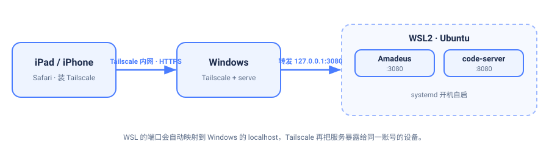
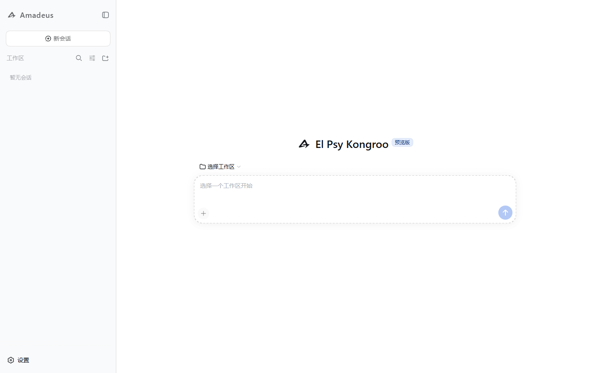

# Amadeus · WSL + iOS 改良版

> 本仓库是 [whyself/Amadeus](https://github.com/whyself/Amadeus)（面向单用户的
> [DeepSeek Harness（DSH）](https://github.com/deepseek-ai/deepseek-harness) 工作台）的**个人改良分支**。
> 它在原版基础上，专门为「**在 Windows 上本地部署**」和「**用 iPad / iPhone 远程使用**」做了适配与修复。

一句话：把一台 Windows 电脑变成自己的学习 / 编程服务器，平板或手机用浏览器随时随地接着用。

## 先选一份适合你的指南

| 你的情况 | 用哪份指南 |
| --- | --- |
| 只有 Windows 电脑，想在本机直接打开使用（**大多数用户**） | [**Windows 本地使用指南**](docs/guide-windows.md) |
| 有 Windows 电脑 + iPad / iPhone，想用平板远程连电脑（**本分支重点**） | [**WSL + iPad 远程使用指南**](docs/guide-wsl-ios.md) |

两份指南都假设电脑「什么都没装」，从零一步步写起，照着复制粘贴即可。

## 这个改良版比官方原版多了什么

- **iOS / Safari 适配**：触摸与双指滚动不再拖走整页；补上 Safari 缺失的旧 API，登录不再卡在加载中。
- **iPad 上的编辑器**：内嵌 code-server 的滚动、点按和滚动条专门修理过，双指手势不再把页面拽动。
- **WSL 原生部署**：附带 systemd 服务写法，Windows 上不用 Docker 也能长期后台运行。
- **Tailscale 远程访问**：Windows 装一次 Tailscale，iPad 用 HTTPS 域名直接连（附 iPad 上的安装说明）。
- **可选增强**：学习进度面板、右侧 JupyterLab 标签、对话关系图（Synapse）。

## 快速开始

### 方案 A · Windows 本地直接用（推荐大多数人）

先安装 [Docker Desktop](https://www.docker.com/products/docker-desktop/) 并启动，然后在 PowerShell 中：

```powershell
git clone https://github.com/YJC18368291437-ai/Amadeus.git
cd Amadeus
Copy-Item amadeus.docker.example.yml amadeus.local.yml
New-Item -ItemType Directory -Force workspace
# 用记事本打开 amadeus.local.yml，把 password: CHANGE-ME 改成自己的密码
docker compose up -d --build
```

看到日志出现 `dsh web: http://...` 后，浏览器打开 <http://127.0.0.1:3080> 登录即可。
完整步骤见 [docs/guide-windows.md](docs/guide-windows.md)。

### 方案 B · WSL + iPad 远程（本分支重点）

1. Windows 装 WSL2 + Ubuntu；Ubuntu 里装 Node 24 与 code-server `4.104.2`。
2. 克隆本项目，`npm ci`、`npm run build`，并对 code-server 打补丁。
3. 写好 `amadeus.local.yml`，用 systemd 把 code-server 和 Amadeus 做成开机自启服务。
4. Windows 装 Tailscale，iPad 也装 Tailscale（**同一个账号**），用 `tailscale serve` 把服务暴露到内网。
5. iPad 用 Safari 打开生成的 HTTPS 域名即可使用。

完整步骤（含 iPad 上安装 Tailscale）见 [docs/guide-wsl-ios.md](docs/guide-wsl-ios.md)。



## 能做什么

| 功能 | 说明 |
| --- | --- |
| 文件预览 | 点击文件默认走 DSH 原生侧栏；支持 HTML、Markdown、PDF、Office、图片和代码 |
| 代码编辑 | 点击文件旁的编辑按钮进入内嵌 code-server；标签、保存和扩展都由它管理 |
| LaTeX | 编译 LaTeX 项目（Docker 镜像已内置 TeX Live；WSL 本地部署需自行安装） |
| 选区注释 | 选中对话、文档或编辑器文本加批注，回答里的引用可点回原文 |
| 工作区 | 上传 / 下载文件，工作区文件保存在宿主机目录 |
| 网页浏览器 | 在右侧侧栏打开隔离的 HTTP(S) 网页，和当前工作区并排浏览 |



## 开发

需要 Node.js 24+：

```bash
npm ci
npm test
npm run build
```

浏览器回归默认调用已安装的 Edge，可用 `TEST_BROWSER_CHANNEL=chrome` 切换。

## 致谢

本分支基于 [whyself/Amadeus](https://github.com/whyself/Amadeus)，版权与许可请以上游项目为准。
