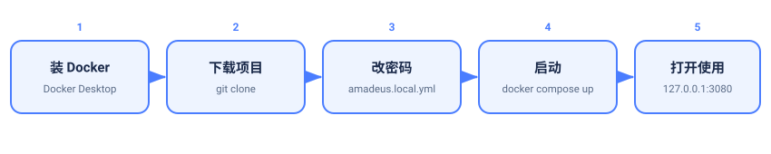

# Windows 本地使用指南（从零开始）

适合：只有一台 Windows 电脑，想在本机直接用，不需要 iPad 远程。
装好后浏览器打开 `http://127.0.0.1:3080` 就能用。全程复制粘贴即可。

> 想用 iPad 远程连这台电脑，请看 [WSL + iPad 远程使用指南](guide-wsl-ios.md)。



## 准备
- Windows 10 / 11（64 位），建议 8GB 内存以上，能上网。
- 安装软件需要管理员权限。

## 1. 装 Docker Desktop
1. 打开 <https://www.docker.com/products/docker-desktop/> ，点 **Download for Windows**。
2. 双击安装，如果问 **Use WSL 2 instead of Hyper-V**，保持勾选。
3. 装完**重启电脑**，打开 Docker Desktop，等左下角小鲸鱼图标变绿。
4. 验证：按 `Win` 搜 `powershell` 打开，输入

   ```powershell
   docker --version
   ```

   能显示版本号就成功。

## 2. 装 Git
到 <https://git-scm.com/download/win> 下载安装，默认选项即可。验证：

```powershell
git --version
```

> 不想装 Git：在项目网页点 **Code → Download ZIP** 解压也行，只是以后升级麻烦。

## 3. 下载项目

```powershell
cd D:\
git clone https://github.com/YJC18368291437-ai/Amadeus.git
cd Amadeus
```

## 4. 改密码

```powershell
Copy-Item amadeus.docker.example.yml amadeus.local.yml
New-Item -ItemType Directory -Force workspace
```

用**记事本**打开 `amadeus.local.yml`，把 `password: CHANGE-ME` 改成自己的密码。
（密码不能留 `CHANGE-ME`，否则启动失败。）`workspace` 文件夹就是以后放资料的地方。

## 5. 启动

```powershell
docker compose up -d --build
```

第一次要 **10～30 分钟**，耐心等。看进度：

```powershell
docker compose logs -f amadeus
```

看到 `dsh web: http://...` 就好了。按 `Ctrl + C` 只是停止看日志，不会关服务。

## 6. 打开使用

浏览器打开 <http://127.0.0.1:3080> ，用第 4 步的账号密码登录。


## 日常

| 想做的事 | 命令（都在 `Amadeus` 目录里执行） |
| --- | --- |
| 启动 | `docker compose up -d` |
| 停止 | `docker compose down` |
| 重启 | `docker compose restart amadeus` |
| 看日志 | `docker compose logs --tail=200 amadeus` |
| 升级 | `git pull` 然后 `docker compose up -d --build` |

- 资料在 `Amadeus\workspace\`；会话和设置存在 Docker 卷 `amadeus-data`，不要删。
- 开机后若服务没起，执行一次 `docker compose up -d`。

## 常见问题
- **找不到 docker 命令**：Docker Desktop 没启动。
- **打不开 127.0.0.1:3080**：先看日志，多半是密码还留着 `CHANGE-ME`。
- **登录页一直转 / 编辑器空白**：刷新页面，或 `docker compose restart amadeus`。
