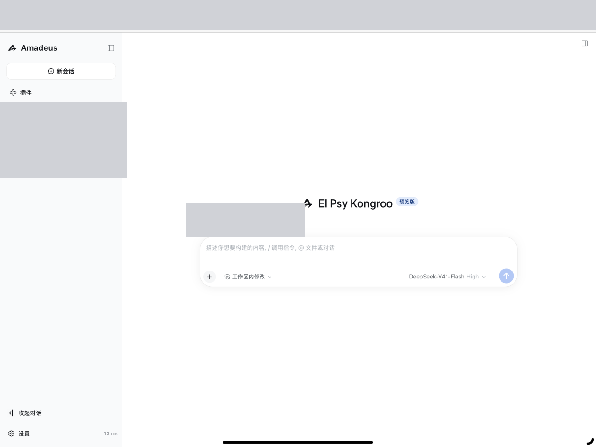
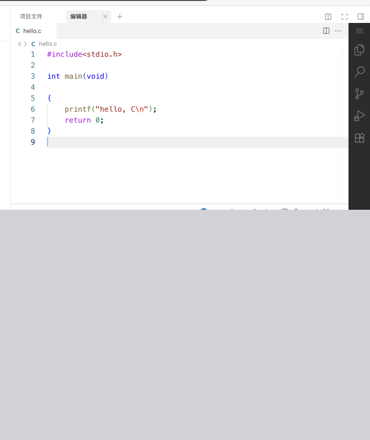
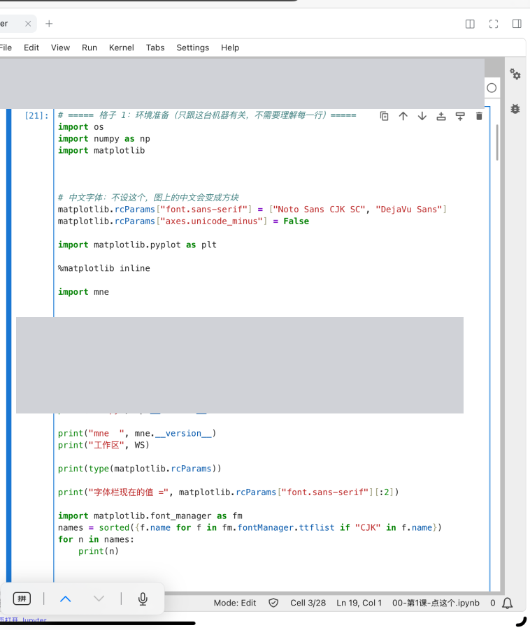

# WSL + iPad 远程使用指南（从零开始）

适合：有一台 Windows 电脑当「服务器」，想用 iPad / iPhone 在**任何地方**（外网也行）远程连上来用。
本文从「什么都没装」的电脑开始，按顺序做即可。

> 只在本机用、不需要 iPad？请看更简单的 [Windows 本地使用指南](guide-windows.md)。


## 准备
- Windows 10 / 11（64 位），一台 iPad / iPhone。
- 一个 Tailscale 账号（免费，邮箱 / Google / Microsoft / GitHub 均可注册）。
- 能上网。

## 第 1 部分：装 WSL2 + Ubuntu
1. 右键开始菜单 → 打开「**终端(管理员)**」，执行：

   ```
   wsl --install -d Ubuntu
   ```

   完成后**重启电脑**。
2. 重启后自动弹出 Ubuntu 窗口，设置 Linux 用户名和密码（记住密码，输密码时屏幕不显示是正常的）。
3. 回到 PowerShell 验证：`wsl -l -v` 能看到 `Ubuntu` 且 `VERSION` 为 `2`。
4. 在 Ubuntu 里开启 systemd（Amadeus 需要它做开机服务）：

   ```
   sudo tee /etc/wsl.conf >/dev/null <<'EOF'
   [boot]
   systemd=true
   EOF
   ```

   然后回 PowerShell 执行 `wsl --shutdown`，再打开一次「Ubuntu」。

> 报错就先 `wsl --update` 再试；仍不行到「控制面板 → 程序 → 启用或关闭 Windows 功能」，
> 勾选「适用于 Linux 的 Windows 子系统」和「虚拟机平台」，重启后再试。

## 第 2 部分：装 Node 24 与 code-server
以下都在 **Ubuntu 窗口**里执行。先装基础工具：

```
sudo apt update && sudo apt install -y curl git build-essential xz-utils
```

装 Node 24：

```
sudo mkdir -p /opt/node
cd /tmp
curl -fsSLO https://nodejs.org/dist/v24.9.0/node-v24.9.0-linux-x64.tar.xz
sudo tar -xJf node-v24.9.0-linux-x64.tar.xz -C /opt/node --strip-components=1
echo 'export PATH=/opt/node/bin:$PATH' | sudo tee /etc/profile.d/node.sh
source /etc/profile.d/node.sh
node --version        # 应显示 v24.9.0
```

> 国内慢可换镜像：把网址换成 `https://npmmirror.com/mirrors/node/v24.9.0/node-v24.9.0-linux-x64.tar.xz`

装 code-server `4.104.2`：

```
cd /tmp
curl -fsSL https://github.com/coder/code-server/releases/download/v4.104.2/code-server-4.104.2-linux-amd64.tar.gz -o code-server.tar.gz
sudo mkdir -p /opt/code-server
sudo tar -xzf code-server.tar.gz --strip-components=1 -C /opt/code-server
sudo ln -sf /opt/code-server/bin/code-server /usr/local/bin/code-server
code-server --version  # 应显示 4.104.2
```

> ARM 电脑（少见）把 `amd64` 换成 `arm64`。

## 第 3 部分：下载并构建 Amadeus

```
sudo mkdir -p /srv
sudo git clone https://github.com/YJC18368291437-ai/Amadeus.git /srv/amadeus
cd /srv/amadeus
sudo /opt/node/bin/npm ci
sudo /opt/node/bin/node scripts/build.mjs
sudo /opt/node/bin/node scripts/patch-code-server.mjs /opt/code-server
```

装**必需的**编辑器桥接扩展：

```
sudo mkdir -p /srv/amadeus/.amadeus/code-server/extensions
sudo cp -a /srv/amadeus/packages/editor/extension \
           /srv/amadeus/.amadeus/code-server/extensions/amadeus.amadeus-bridge-1.0.0
```

<details><summary>（可选）LaTeX 支持</summary>

要用 LaTeX 才装：

```
cd /tmp
curl -fsSL https://open-vsx.org/api/James-Yu/latex-workshop/10.9.0/file/James-Yu.latex-workshop-10.9.0.vsix -o lw.vsix
sudo /opt/code-server/bin/code-server --extensions-dir /srv/amadeus/.amadeus/code-server/extensions \
  --user-data-dir /tmp/cs-install --install-extension /tmp/lw.vsix
sudo rm -rf /tmp/cs-install
sudo /opt/node/bin/node /srv/amadeus/scripts/patch-latex-workshop.mjs \
  /srv/amadeus/.amadeus/code-server/extensions/james-yu.latex-workshop-10.9.0
sudo apt install -y texlive-xetex texlive-lang-chinese texlive-latex-extra latexmk biber fonts-noto-cjk
```
</details>

## 第 4 部分：配置 + 开机服务

### 4.1 写配置

```
cd /srv/amadeus
sudo cp amadeus.example.yml amadeus.local.yml
sudo nano amadeus.local.yml
```

改成这样（`password` 换成自己的，**不能留 CHANGE-ME**）：

```yaml
username: amadeus
password: 换成你的密码
host: 0.0.0.0
port: 3080
sessionHours: 168
workspace: /srv/amadeus-workspace
editor:
  upstream: http://127.0.0.1:8080
playwrightMcp:
  enabled: false
```

保存退出：`Ctrl+O` → 回车 → `Ctrl+X`。然后建工作区目录：

```
sudo mkdir -p /srv/amadeus-workspace
```

### 4.2 写两个服务

`code-server.service`：

```
sudo tee /etc/systemd/system/code-server.service >/dev/null <<'EOF'
[Unit]
Description=code-server for Amadeus editor
After=network.target

[Service]
Type=simple
Environment=AMADEUS_EDITOR_BRIDGE_DIR=/srv/amadeus/.amadeus/dsh-home/editor/bridge
ExecStart=/usr/local/bin/code-server --bind-addr 127.0.0.1:8080 --auth none --disable-telemetry --disable-update-check --disable-workspace-trust --user-data-dir /srv/amadeus/.amadeus/code-server --extensions-dir /srv/amadeus/.amadeus/code-server/extensions /srv/amadeus-workspace
Restart=on-failure
RestartSec=3

[Install]
WantedBy=multi-user.target
EOF
```

`amadeus.service`：

```
sudo tee /etc/systemd/system/amadeus.service >/dev/null <<'EOF'
[Unit]
Description=Amadeus DSH document workspace
After=network-online.target
Wants=network-online.target

[Service]
Type=simple
WorkingDirectory=/srv/amadeus
Environment=NODE_ENV=production
Environment=AMADEUS_CONFIG=/srv/amadeus/amadeus.local.yml
Environment=PATH=/opt/node/bin:/usr/local/sbin:/usr/local/bin:/usr/sbin:/usr/bin:/sbin:/bin
Environment=PLAYWRIGHT_DOWNLOAD_HOST=https://cdn.npmmirror.com/binaries/playwright
ExecStart=/opt/node/bin/node /srv/amadeus/scripts/start.mjs
Restart=on-failure
RestartSec=5
KillMode=control-group
TimeoutStopSec=30
UMask=0077

[Install]
WantedBy=multi-user.target
EOF
```

启用并启动：

```
sudo systemctl daemon-reload
sudo systemctl enable --now code-server amadeus
systemctl --no-pager status code-server amadeus
curl -I http://127.0.0.1:3080     # 返回 401 或 200 都算正常
```

## 第 5 部分：Tailscale（让 iPad 连进来）

### 5.1 Windows 装 Tailscale
1. 到 <https://tailscale.com/download/windows> 下载安装。
2. 点 **Log in**，用邮箱 / Google / Microsoft / GitHub 登录。**记住账号，iPad 要用同一个。**
3. 在 PowerShell 执行 `tailscale status`，第一行的 `laptop-xxxx` 就是你的设备名。

### 5.2 开启 HTTPS 证书
打开 <https://login.tailscale.com/admin/dns> ：确认 **MagicDNS** 已开启，并在 **HTTPS Certificates** 点点 **Enable HTTPS**。

### 5.3 把 Amadeus 暴露到内网
在 **Windows 管理员 PowerShell** 执行（端口换成你配置里的 `port`）：

```
tailscale serve --bg 3080
```

会得到一个地址，形如 `https://laptop-xxxx.你的tailnet名.ts.net`，**记下来**。用 `tailscale serve status` 可随时查看。

### 5.4 iPad 装 Tailscale
1. App Store 搜 **Tailscale** 安装。
   - **国内 App Store 可能搜不到**：用一个**海外 Apple ID** 登录 App Store 后再搜；若一时搞不定，
     可到 <https://www.iios.ga> 找一个可用的 Apple ID 下载，**下完切回自己的 Apple ID，别用它登 iCloud**。
2. 打开 App，用**和 Windows 完全相同的账号**登录，并打开连接开关。

### 5.5 iPad 使用
Safari 打开 5.3 的地址 `https://laptop-xxxx.xxx.ts.net`，输入账号密码登录。
建议点 **分享 → 添加到主屏幕**，以后像 App 一样一点就开。

## 实机效果（iPad）




## 日常与排错
- **开机后**：确认 Windows 上 Tailscale 已登录；打开一次「Ubuntu」（或运行 `wsl -d Ubuntu true`）让服务起来。
- **升级**：

  ```
  cd /srv/amadeus
  sudo git pull
  sudo /opt/node/bin/npm ci
  sudo /opt/node/bin/node scripts/build.mjs
  sudo systemctl restart amadeus
  ```

- **连不上**：① Ubuntu 里 `curl -I http://127.0.0.1:3080` 有没有响应，没有就看 `systemctl status amadeus`；
  ② Windows 里 `tailscale status` 两台设备是否都 `online`、`tailscale serve status` 代理还在不在；
  ③ iPad 的 Tailscale 开关和账号对不对。
- **改过端口**：`tailscale serve reset` 后重新 `tailscale serve --bg 新端口`。

**（可选）开机自动拉起 WSL**：用「任务计划程序」新建任务，触发器选「登录时」，操作填
`wsl.exe -d Ubuntu -u root -e /bin/true`。
